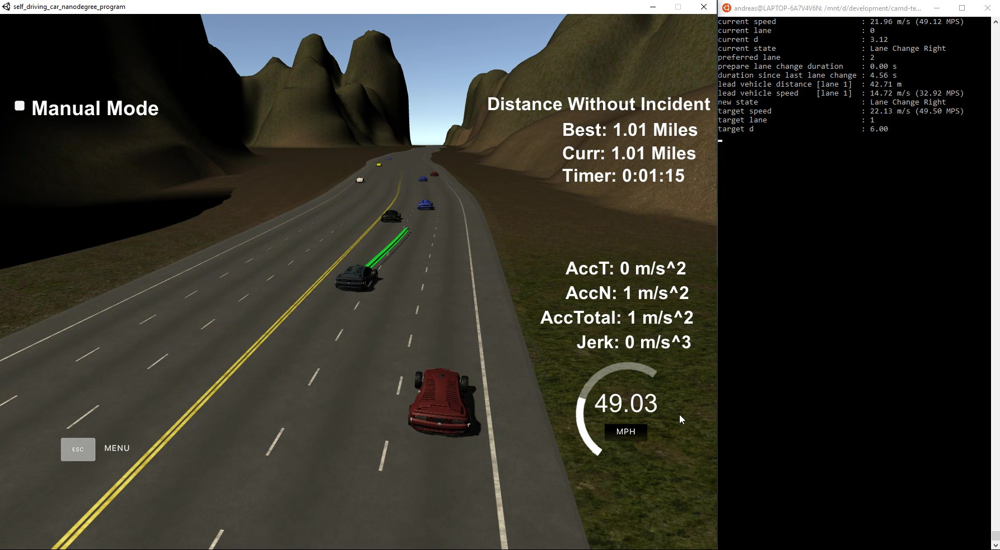

# **Path-Planning**

#### Udacity Self Driving Car Engineer Nanodegree Program - Term 2

## Project Introduction
In this project the goal is to safely navigate around a virtual highway with other traffic that is driving +-10 MPH of the 50 MPH speed limit. You will be provided the car's localization and sensor fusion data, there is also a sparse map list of waypoints around the highway. The car should try to go as close as possible to the 50 MPH speed limit, which means passing slower traffic when possible, note that other cars will try to change lanes too. The car should avoid hitting other cars at all cost as well as driving inside of the marked road lanes at all times, unless going from one lane to another. The car should be able to make one complete loop around the 6946m highway. Since the car is trying to go 50 MPH, it should take a little over 5 minutes to complete 1 loop. Also the car should not experience total acceleration over 10 m/s^2 and jerk that is greater than 10 m/s^3.



#### The map of the highway is in data/highway_map.txt
Each waypoint in the list contains  [x,y,s,dx,dy] values. x and y are the waypoint's map coordinate position, the s value is the distance along the road to get to that waypoint in meters, the dx and dy values define the unit normal vector pointing outward of the highway loop.

The highway's waypoints loop around so the frenet s value, distance along the road, goes from 0 to 6945.554.

Here is the data provided from the Simulator to the C++ Program

#### Main car's localization Data (No Noise)

["x"] The car's x position in map coordinates

["y"] The car's y position in map coordinates

["s"] The car's s position in frenet coordinates

["d"] The car's d position in frenet coordinates

["yaw"] The car's yaw angle in the map

["speed"] The car's speed in MPH

#### Previous path data given to the Planner

["previous_path_x"] The previous list of x points previously given to the simulator

["previous_path_y"] The previous list of y points previously given to the simulator

#### Previous path's end s and d values 

["end_path_s"] The previous list's last point's frenet s value

["end_path_d"] The previous list's last point's frenet d value

#### Sensor Fusion Data, a list of all other car's attributes on the same side of the road. (No Noise)

["sensor_fusion"] A 2d vector of cars and then that car's [car's unique ID, car's x position in map coordinates, car's y position in map coordinates, car's x velocity in m/s, car's y velocity in m/s, car's s position in frenet coordinates, car's d position in frenet coordinates. 

##### Details

1. The car uses a perfect controller and will visit every (x,y) point it recieves in the list every .02 seconds. The units for the (x,y) points are in meters and the spacing of the points determines the speed of the car. The vector going from a point to the next point in the list dictates the angle of the car. Acceleration both in the tangential and normal directions is measured along with the jerk, the rate of change of total Acceleration. The (x,y) point paths that the planner recieves should not have a total acceleration that goes over 10 m/s^2, also the jerk should not go over 50 m/s^3. (NOTE: As this is BETA, these requirements might change. Also currently jerk is over a .02 second interval, it would probably be better to average total acceleration over 1 second and measure jerk from that.

2. There will be some latency between the simulator running and the path planner returning a path, with optimized code usually its not very long maybe just 1-3 time steps. During this delay the simulator will continue using points that it was last given, because of this its a good idea to store the last points you have used so you can have a smooth transition. previous_path_x, and previous_path_y can be helpful for this transition since they show the last points given to the simulator controller with the processed points already removed. You would either return a path that extends this previous path or make sure to create a new path that has a smooth transition with this last path.

## Solution Description
Essentially, two main tasks have to be fulfilled:

#### Behavior Planning
Model-based approach to depict human-like driving behavior. The driving behavior is responsible to decide from the current traffic situation on lane change, speed and acceleration, whereby traffic rules, safety and driving comfort are to be considered.


#### Trajectory Planning
Calculates the optimal trajectory for the vehicle from the target lane, speed and acceleration delivered by behavior planning.


(Source: Udacity Self Driving Car Engineer Nanodegree Program)

### Model Documentation:

#### Behavior Planning
The behavior planning is implemented in [HighwayDrivingBehavior.cpp](src/HighwayDrivingBehavior.cpp)

##### Responsibility:
Decides on the basis of the current traffic situation about lane change, speed and acceleration. It should be driven at the maximum permissible speed, taking into account traffic rules, safety and driving comfort.

The following requirements apply (see [Project Rubric](https://review.udacity.com/#!/rubrics/1971/view)):
* Compliance with traffic regulations (maximum speed 50 MPS, safety distance, driving only in the designated lanes)
* Avoid collisions with other road users at all costs
* Consideration to driving comfort (maximum acceleration 10 m/s², max jerk 10 m/s³)
* Driving at the maximum permissible speed, if possible.

##### Input:
* Current reference speed [m/s] (here constant 22.18 m/s = 49.5 MPS)
* Current vehicle position (Frenet)
* Current traffic lane
* Current positions of other vehicles (Frenet)

##### Output:
* Target speed [m/s]
* Target acceleration [m/s²] (here constant 9.0 m/s²)
* Target lane

##### Method:
The driving behavior is realized with a finite state machine:

(Source: Udacity Self Driving Car Engineer Nanodegree Program)

This starts in the state "Keep Lane". In this state, the vehicle follows the leading vehicle at a safe distance or at the maximum permitted speed when the distance to the leading vehicle is large enough. Furthermore, it is checked in this state, which lane is currently the cheapest. For this, costs are calculated for each of the 3 lanes and the lane with the lowest cost is selected. If another lane proves to be better, the lane change is prepared (Prepare Lane Chane Left/Right).

Lane costs are calculated according to the following criteria:
* Higher costs the more vehicles are ahead in the lane
* Higher costs, the closer the distance to the vehicle in front is
* Higher costs, the lower the average driving speed of the lane
* Higher costs, the farther left the lane is (drive right preferred)

The states "Prepare Lane Change Left/Right" are used to prepare the lane change. For this purpose, the speed of the vehicle is adapted to the speed of the new lane and waited for a gap in the new lane, which is large enough to make the lane change. If such a gap is found, the lane change is executed (Lane Change Left/Right). However, if the distance to the vehicle in front is too small or if there is no suitable gap within 6 seconds, the process is aborted and the current lane is maintained (Keep Lane).

In the states "Lane Change Left/Right" the speed of the vehicle is adapted to the speed of the vehicle ahead of the new lane and changed to the new lane. When the new lane is reached, it is maintained (Keep Lane).

A short wait delay of 3 seconds between lane changes ensures that the vehicle does not make any serpentine lines between lanes when changing to the previous lane immediately after reaching a lane.


The implementation uses the following behavioral states:

|Behavior State           |Description|
|-------------------------|-----------|
|Keep Lane                |Keeps the vehicle in the current lane:<br><br> • Keeps safe distance to the vehicle ahead <br>• Decides which traffic lane is the preferred traffic lane (=> Prepare Lane Change Left/Right)|
|Prepare Lane Change Left |Prepares the change to the left lane:<br><br> • Adapts speed of the left lane<br> • Checks whether a safe change to the left lane possible<br> • Initiates change to the left lane, if possible (=> Lane Change Left)<br> • Aborted if the safety distance to the vehicle ahead is too low (=> Keep Lane)<br> • Aborted if the max. duration of 3 seconds is reached (=> Keep Lane)|
|Prepare Lane Change Right|Prepares the change to the right lane:<br><br> • Adapts speed of the right lane<br> • Checks whether a safe change to the right lane possible<br> • Initiates change to the right lane, if possible (=> Lane Change Right)<br> • Aborted if the safety distance to the vehicle ahead is too low (=> Keep Lane)<br> • Aborted if the max. duration of 3 seconds is reached (=> Keep Lane)|
|Lane Change Left         |Performs change to the left lane:<br><br> • Adopts speed of the left lane<br> • Ends when reaching the left lane (=> Keep Lane)|
|Lane Change Right        |Performs change to the right lane:<br><br> • Adopts speed of the right lane<br> • Ends when reaching the right lane (=> Keep Lane)|

#### Trajectory Planning
The trajectory planning is implemented in [TrajectoryPlanner.cpp](src/TrajectoryPlanner.cpp)

##### Responsibility:
Calculates a new path based on the last path, the planned route, the current vehicle position and velocity and the current positions of other road users.

##### Input:
* Points of the last path planning in the Cartesian coordinate system of the map
* Waypoints of the planned route in the coordinate system of the map
* Current positions of other vehicles (Frenet)
* Current position and orientation (x, y, yaw) of the vehicle in the Cartesian coordinate system of the map
* Current position of the vehicle (Frenet)
* Current speed of the vehicle [m/s].

##### Output:
* New calculated path in Cartesian coordinate system of the map

##### Method:
Uses the [HighwayDrivingBehavior](src/HighwayDrivingBehavior.cpp) to determine the current target -lane, -speed and -acceleration and calculates the next path points from it. Then the last path will be extended by the new path points.

For simplicity, the new lane points will be generated in the target lane in Frenet coordinates. These are first transformed into the Cartesian coordinate system of the map and then transferred to simplify the path calculation in the Cartesian coordinate system of the vehicle (translation + rotation). From the last two points of the previous lane and these new lane points, a spline curve is calculated that represents the smoothest possible transition from the old points to the new points. This ensures the smoothest possible movement when changing lanes.

Using the calculated spline curve and the current target speed and acceleration, the new path points are now calculated and transformed back from the vehicle's coordinate system to the map's coordinate system.

## Prerequisites
To compile this project the following programming environment is required:

* cmake >= 3.5
  * All OSes: [click here for installation instructions](https://cmake.org/install/)
* make >= 4.1
  * Linux: make is installed by default on most Linux distros
  * Mac: [install Xcode command line tools to get make](https://developer.apple.com/xcode/features/)
  * Windows: [Click here for installation instructions](http://gnuwin32.sourceforge.net/packages/make.htm)
* gcc/g++ >= 5.4
  * Linux: gcc / g++ is installed by default on most Linux distros
  * Mac: same deal as make - [install Xcode command line tools]((https://developer.apple.com/xcode/features/)
  * Windows: recommend using [MinGW](http://www.mingw.org/)
* [uWebSockets](https://github.com/uWebSockets/uWebSockets)
  * Run either `install-mac.sh` or `install-ubuntu.sh`.
  * If you install from source, checkout to commit `e94b6e1`, i.e.
    ```
    git clone https://github.com/uWebSockets/uWebSockets 
    cd uWebSockets
    git checkout e94b6e1
    ```

To test the project, you need the Term3 Simulator from Udacity, which you can download [here](https://github.com/udacity/self-driving-car-sim/releases/tag/T3_v1.2).

To run the simulator on Mac/Linux, first make the binary file executable with the following command:
```shell
sudo chmod u+x {simulator_file_name}
```

### Compiling and executing
Follow these instructions to compile and run this project:

1. Clone this repo (https://github.com/aboerzel/Path-Planning).
2. Make a build subdirectory and change to it with: `mkdir build && cd build`
3. Compile the project using the command: `cmake .. && make` 
   * On windows, you may need to run: `cmake .. -G "Unix Makefiles" && make`
4. Run the project with: `./path_planning`

## Running the Path Planning
Follow these instructions to test the project:

1. Run the path planning project from the build subdirectory with command: `./path_planning`
2. Run the [Simulator](https://github.com/udacity/self-driving-car-sim/releases/tag/T3_v1.2) (Project 1: Path Planning) 
3. Press the `SELECT` button.

The following video shows the vehicle driving one lap on the highway:

[](https://youtu.be/UJbwyKS844Q)